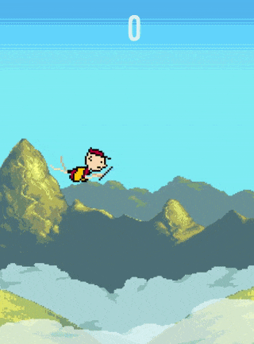

# Flappy Milennial

Help this Flappy Millennial ignore reality while he scrolls through Instagram or something. Play this game not because it's good or anything, but simply to pretend that everything is okay for a while.

## Why? 

I was writing an HTML5 canvas game engine for a different game. But that's going to take a long while to finish (if ever, that is).
This game was made with a version of that game engine.

# How to play?

Game is live at [nirav.com.np/flappy-millennial](https://nirav.com.np/flappy-millennial).

# How to play locally?

Many ways. First clone the repository with `git clone https://github.com/niravcodes/flappy-millennial` and cd into the folder.
Then easiest would be to open the file at `dist/index.html` in a browser. But that's the minified code, and doesn't encourage tinkering.
If you have a relatively modern browser (say Firefox 70 something or Chrome 80 something) you should be able to run the development code 
just fine. But the development code uses js modules, so it must be served over http. Run a simple HTTP server on the directory root. Simplest 
way I know of is `python3 -m http.server <port>` or it's equivalent. Access by navigating to `localhost:<port>`.    

For the uninitiated, click on the green button labelled "Clone or Download" at the top of this page, download the zip, unzip, and open the file `index.html` 
inside the `dist` folder.

Depending on what you want to do, **you probably don't have to `npm install`**. I don't know about you, but it makes me very happy when I don't
have to `npm install` (or install anything, for that matter).

## But I want to `npm install`!

If you must, go ahead. I'm using npm to orchestrate Babel, Browserify and Google-closure-compiler to convert my ES6 JavaScript code to ES5 (so that
it's supported in most browsers, including mobile). Without this conversion, the game fails to work on mobile browsers and also in Firefox 68.0 ESR 
(which is the default browser of Debian 10). 

Once you've `npm install`ed, try `npm run build`. It executes `./build.sh` and creates a optimized game in the `dist` folder.

# Other works used

The background was made by Vicente Nitti (@vnitti_art on Twitter). Check out some of his work [here](https://vnitti.itch.io/).

Uses [Fingerprintjs2](https://github.com/Valve/fingerprintjs2) by Valve and 
[ua-parser-js](https://github.com/faisalman/ua-parser-js) for analytics. Not strictly 
necessary for the game to function.

Uses Babel and Browserify to convert ES6 JavaScript (supported by modern browsers) to
ES5 JavaScript. Uses Google Closure Compiler to minify.